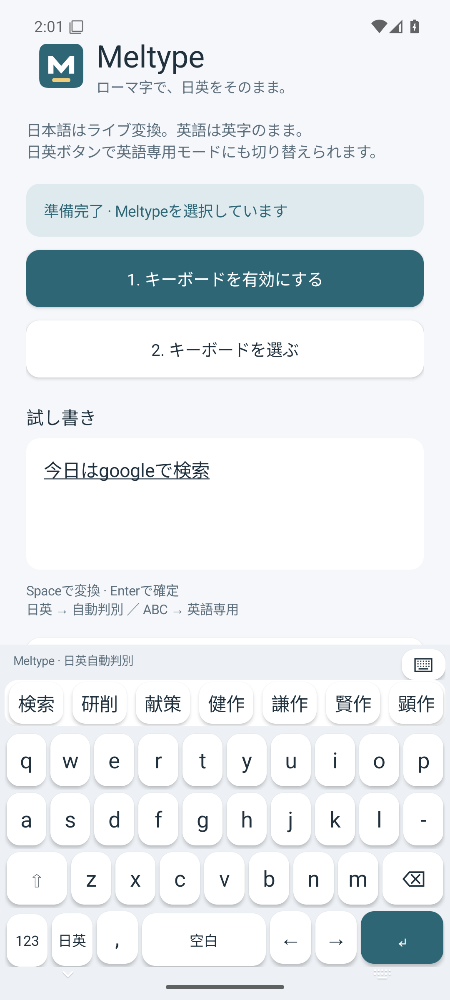
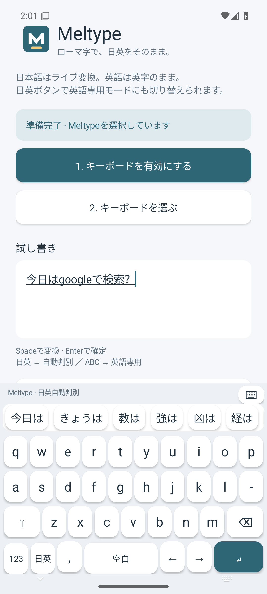
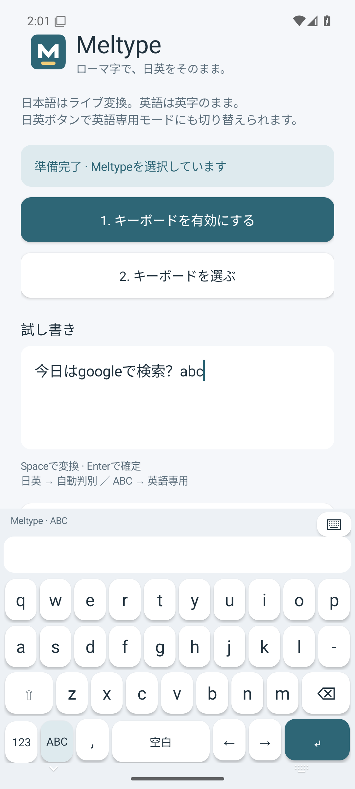

# Meltype Android 試作版

[雪代／Yukishiro氏のMeltype](https://github.com/yksr-melt/Meltype)を基にした非公式Androidキーボードです。Android版はこの専用リポジトリで開発・配布します。Windows版の導入は[PC版のREADME](https://github.com/AoneSenbongi/Meltype/tree/google-native-ime)を参照してください。

PC版と分離し、元のMeltypeからのGit履歴と著作権表記を引き継いだ独立リポジトリです。0.3.0のAPKは旧0.2.0と署名が異なるため、上書き更新できません。旧版の削除で学習データも消えます。

## できること

QWERTYのローマ字入力で、日英自動判別とOSS版Mozcによるライブ変換を使えます。文字は使用中のアプリの入力欄へ未確定文字として表示します。入力中から上部に変換候補を表示し、タップすると選択中の文節までを確定し、後続文節の変換を続けられます。Spaceで候補を選び、Enterで確定することもできます。

「日英切替」を押すと英語だけの直接入力になり、もう一度押すとMeltypeの日英自動判別へ戻ります。切替前の未確定文字は確定して残します。日本語の句読点は全角の「，」「．」です。フリック入力はありません。

0.3.0ではキーのタッチ範囲、文字と候補の表示、長押し削除を改良し、記号欄へ「」を追加しました。「，」キーは語尾から文末を推定して「．」へ切り替えます。候補がないときは候補欄の右端からキーボードを閉じられます。詳細と検証範囲は[0.3.0の変更点](docs/ANDROID_RELEASE_0_3_0.md)を参照してください。

## インストール

対象はAndroid 8.0以降のarm64端末です。x86_64はエミュレーターの検証用です。

1. [Android試作版0.3.0のRelease](https://github.com/AoneSenbongi/Meltype-Android/releases/tag/android-prototype-0.3.0)から `Meltype-Android-0.3.0.apk` を端末へダウンロードします。
2. APKを開き、ダウンロードに使ったアプリからのインストールを許可します。
3. Meltypeアプリを開き、「キーボードを有効にする」で有効にします。
4. 「キーボードを選ぶ」でMeltypeを選び、アプリ内の試し書き欄で入力します。

元のキーボードへ戻す場合は右上のキーボードボタンから選択します。署名は試作用で、自動更新はありません。署名が異なる旧版からは、旧版を削除してからインストールします。削除ではアプリの学習データも消えます。

## 公開版と開発状況

0.2.0では専用アイコンと導入状態の表示を追加しました。SimejiのQWERTY配置を参考に英字3段と操作1段へ整理し、数字・記号は「123」で切り替えます。Shiftで大文字の表示になり、コンマを長押しするとピリオドを入力します。

### 画面

以下は0.2.0の画面です。0.3.0で追加した文字表示欄と閉じるボタンは写っていません。

| 導入画面 | ローマ字キーボード |
| --- | --- |
|  |  |

| 変換候補 | 英語専用モード |
| --- | --- |
|  |  |

本家Meltype 1.0.1の修正を取り込み、日英判別・句読点・モード切替・未確定文字の保持・取消・入力中の候補選択をテストしています。旧0.1.0は、本家1.0.1の取り込み前のAPKです。

0.2.0の公開APKはAndroid 15のx86_64エミュレーターで、Mozcとの接続、日英混在、句読点、入力欄の未確定表示と確定を確認しています。0.2.0では実際のキー操作による候補表示・選択、数字・記号への切替、Shiftのキー表示、英語専用モードへの切替も通過しました。0.3.0では入力処理試験と共有コア184件の試験、APKビルドを通過しました。今回変更したUIの実機・エミュレーター操作試験は未実施です。実機での入力速度、各アプリのカーソル・改行・画面回転・長時間入力は未確認です。

## 辞書とプライバシー

変換にはOSS版MozcとOSS辞書を同梱します。GboardやWindowsのGoogle日本語入力のプログラム・辞書・学習履歴とは連携しません。入力は端末内で処理し、インターネット権限を要求しません。パスワード欄と数字入力欄は直接入力とし、変換・学習を行いません。

キーボードは利用者が入力した文字を扱うため、Androidの有効化時には入力内容へのアクセスについて警告が表示されます。許可する前に、配布元と[セキュリティ説明](SECURITY.md)を確認してください。

0.3.0の句読点キーは、文末を推定するためカーソル直前の最大128文字を取得します。取得した文字そのものを保存・送信せず、パスワードなどの直接入力欄では取得しません。通常の変換学習とは別の処理です。

権限、学習データの保存と削除、ログ、パスワード欄の検出条件、試作用の署名、脆弱性の報告先は[このForkのセキュリティ説明](SECURITY.md)を確認してください。パスワード欄の検出は入力先アプリの指定に依存します。

[導入・ビルド手順と検証範囲](docs/ANDROID_PROTOTYPE.md)を参照してください。Meltypeの[GPL](LICENSE)と元作者の表記を維持しています。対応するソースZIPと、Mozc・辞書・依存ライブラリのライセンス通知をReleaseに添付します。APK内の「ライセンス」からも通知を参照できます。
